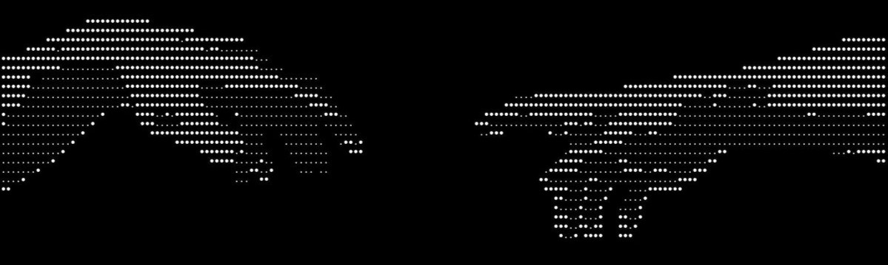

<div align="right">
  <strong>Language:</strong> 
  <a href="./README.md">English</a> | 
  <a href="./README.es.md">Español</a>
</div>

<div id="user-content-toc">
  <ul align="center">
    <summary><h1 style="display: inline-block; color: #3178C6">Hi 👋, I'm <span style="color: #3ECF8E">Ian Pontorno</span></h1></summary>
  </ul>
</div>

<!-- Banner -->
<p align="center">
  
</p>

---

## 👋 About Me

I'm a **Growth Engineer & Full-Stack Developer** based in Buenos Aires, Argentina. I bridge the gap between digital product development, Artificial Intelligence, data systems, and performance marketing to build practical, high-impact, and scalable software solutions.

My professional foundation combines hands-on engineering (modern full-stack architecture, desktop clients, local AI workflows) with operational optimization and revenue-driven marketing (Meta Ads, Google Ads, conversion funnels). I turn complex operational bottlenecks and business goals into automated, maintainable systems.

- 🔭 **Focus Areas**: Full-Stack Web & Desktop Apps, Applied AI & Local Semantic Search, ETL & Data Pipelines, Performance Marketing & Growth Systems.
- 💼 **Current Role**: Marketing Engineer (Paid Media & Automation) at **Fanger Design**.
- 🌐 **Portfolio**: [ian-pontorno-portfolio.vercel.app](https://ian-pontorno-portfolio.vercel.app/)
- 📬 **Connect**: [LinkedIn](https://www.linkedin.com/in/ian-franco-collada-pontorno/) • [GitHub](https://github.com/Ian9Franco)

---

## 🛠️ Tech Stack & Capabilities

```
┌─────────────────┬────────────────────────────────────────────────────────────────────────┐
│ Frontend / App  │ Next.js 16 (Turbopack), React 19, TypeScript, Electron, Tailwind CSS   │
│ Backend / Cloud │ Node.js, Python, Supabase (PostgreSQL + RLS), REST APIs, Docker, AWS   │
│ Data & AI       │ Local Embeddings, Semantic Search, D3.js, Recharts, Power BI, ETL     │
│ Growth & Media  │ Meta Ads Manager, Google Ads (Search & Display), Tracking & Funnels    │
└─────────────────┴────────────────────────────────────────────────────────────────────────┘
```

---

## 🚀 Selected Projects

### 🎮 [MIM — Minecraft Intelligent Manager & Ecosystem](https://mim-hub.vercel.app/)
A production-ready, full-stack modding ecosystem unifying a native desktop suite (**Electron 42 + Next.js 16 Standalone / React 19**), a mobile-first companion web app (**MIMweb**), and real-time community collaboration (**FOMO Cloud** via Supabase).
- **MIM (Modpack Maker) & MIMU (User Mode)**: Dual operational modes tailored for creators (hotkey-based `1-9` rapid classification, client/server tier isolation, and 1-click ZIP compilation) alongside a frictionless interface for casual players.
- **MIMweb & FOMO Hub (Mobile-First)**: Companion web application allowing users to discover mods via dual Modrinth/CurseForge search, translate Markdown descriptions in real time, and curate modpack drafts on the go.
- **FOMO Cloud (Supabase Realtime & PostgreSQL)**: Collaborative cloud layer featuring user clubs, pinned mod recommendations, and shared drafts synchronized seamlessly between mobile and desktop devices.
- **SAGE Crash Forensics & NBT Player Rescue**: Heuristic Java stacktrace analyzer combined with an interactive binary NBT editor to repair inventories, unstick players from corrupted chunks, and auto-generate backups (`.mim_bak`).
- **Security Engine & VirusTotal Cloud**: Static Java bytecode analysis (detecting reflection abuse, process executions, and suspicious system calls) backed by an asynchronous VirusTotal API pipeline.
- **Aduana (Real-Time Deduplication Gate)**: Zero-latency file monitoring powered by Chokidar that hashes downloads in milliseconds and serves cached local copies to save bandwidth.
- **Liquid Glass UI & 3D Skinview Canvas**: Immersive glassmorphic interface with 60fps virtualized lists (`react-window`), interactive soundscapes, and live 3D WebGL player skin rendering.

---

### ⚡ [Elseframe Comics — Web Reader & Lore Platform](https://theboyz-comic.vercel.app/)
An interactive, high-impact Pop-Art / Sci-Fi web comic platform and authoring suite built with **Next.js 15 (Turbopack)**, **TypeScript**, **Framer Motion**, and a zero-cost decoupled storage architecture hosted on CDN.
- **Cinematic Zoom Reader**: Guided panel-by-panel reading experience with smooth bezier curve transitions, dynamic spoiler masking, responsive layout scaling, and authentic comic typography (*Bangers*, *Anime Ace*).
- **In-App Visual Dialogue & Camera Editor**: Real-time drag-and-drop bubble editor with interactive cubic-bezier anchor tails, camera stop sequencer, and magnetic snap-to-grid controls.
- **V.O.P.S. Classified Lore Hub**: Progressive unlock system tracking reading milestones in `localStorage` to reveal interactive holographic character profiles and redacted universe documents.
- **Dynamic Asset Streaming**: Zero-latency panel streaming with automatic prefetching, responsive WebP rasterization, and decoupled asset hosting.

---

### 🧠 [Smart Scan (.smart.scan) — Intelligent Local AI File Explorer](https://github.com/Ian9Franco/.smart.scan)
An intelligent local file explorer and digital asset manager tailored for designers, developers, and creatives, featuring 100% offline local AI semantic search.
- **Brain Mode (Local AI Semantic Search)**: 100% offline semantic AI engine powered by local vector embeddings, enabling natural language search across file contents, visual assets, sketches, audio, and documents without third-party cloud dependencies.
- **Zero-Touch Integrity Architecture**: Non-destructive indexing engine that reads, analyzes, and catalogs local assets without modifying timestamps, directory trees, or file metadata.
- **High-Performance Multimedia Preview & Conversion**: Instant batch previews and lightning-fast format conversion across design files (PNG, WebP, SVG, PSD, audio), drastically speeding up creative asset workflows.
- **Smart Tagging & Workspace Organization**: Automated semantic tagging, visual duplicate detection, and intelligent directory clustering for rapid project retrieval.

---

### 🎬 [Plotter — Film Discovery & Creative Review Studio](https://plotter-reviews.vercel.app/)
A premium film discovery and social review platform designed for cinephiles, combining **Next.js 14 (App Router)**, **TypeScript**, **Tailwind CSS**, and **Framer Motion** with deep neumorphic aesthetics.
- **Dynamic 3D & Neobrutalist Discoveries**: Interactive full-screen hero banner with real perspective 3D card carousels (`perspective: 1200px`) and neobrutalist sliders for TV series.
- **Canvas Card Review Engine**: Custom HTML5 Canvas engine enabling users to style, rate, apply vintage film grain textures, customize typography, and export high-resolution review cards tailored for Instagram Stories, Twitter, and TikTok.
- **Watch Providers Geo-Engine**: Real-time streaming availability integration consuming TMDb/JustWatch APIs to display regional streaming, rental, and purchasing options.
- **Serverless API Proxy & Smart Caching**: Concurrent multi-page proxy routes (`/api/tmdb`, `/api/omdb`) with request deduplication and custom skeleton loaders for sub-second page transitions.

---

### 🔐 [Pontorno Vault (Family Vault) — Zero-Knowledge Credential Safe](https://github.com/Ian9Franco/Pontorno-vault)
A modern, zero-knowledge family credential and subscription manager engineered with **Next.js 16 (App Router)**, **TypeScript**, **Supabase (PostgreSQL + RLS)**, and client-side **Envelope Encryption**.
- **Cryptographic Envelope Hierarchy**: Implements Argon2id WASM key derivation (`64MB`, `3 iterations`, `4 threads`) deriving a 256-bit KEK to unwrap a random User Master Key entirely inside browser memory.
- **Zero-Knowledge Multi-User Vault Sharing**: Multi-tenant symmetric vault key sharing allowing families to share credentials securely without ever exposing master passwords or plaintext secrets.
- **Instant Password Rotation Without Re-encryption**: Master password changes only require re-wrapping the `UserMasterKey` with the new KEK, eliminating the need to re-encrypt individual credentials.
- **Total Metadata Shielding**: The entire credential payload (`platform`, `username`, `password`, `url`, `notes`) is encrypted within `encrypted_payload` via AES-256-GCM, preventing data exposure even in the event of a full database leak.

---

### ⚡ [Web-Sling Optimizer — E-Commerce Asset & Image Suite](https://web-sling-optimizer.vercel.app/)
A specialized web tool designed for e-commerce platforms and digital stores to optimize, protect, and process product catalogs at scale.
- **Next-Gen Batch Conversion & Compression**: High-efficiency compression pipeline converting heavy product photography into optimized WebP and AVIF formats with custom quality presets.
- **EXIF & GPS Sanitizer**: Automatic detection and stripping of sensitive capture metadata, device serial numbers, and geographical GPS coordinates to safeguard catalog privacy.
- **Dynamic Watermark Engine**: Real-time batch application of text and graphic watermarks with full control over opacity, positioning, scaling, and rotation.
- **Zero-Latency In-Browser Processing**: Client-side execution with multithreading support for rapid processing without unnecessary server roundtrips.

---

### 🎯 [Q-Sale — Tactical Gaming Squad Hub & PWA](https://q-sale.vercel.app/)
A tactical Progressive Web App (PWA) designed to organize competitive gaming sessions, manage availability, and assemble 5/5 squads for Rainbow Six Siege.
- **Tactical Squad Coordination (5/5 Squads)**: Live roster availability tracker and role distributor tailored for competitive team dynamics.
- **Discord Voice & Presence Integration**: Real-time synchronization of player voice status, matchmaking queue presence, and team availability.
- **PWA & Low-Latency Web Audio**: Installable cross-platform PWA with offline-first caching, push alerts, and tactile game soundscapes powered by the Web Audio API.

---

### 🧵 [Produ Estudio — Streetwear Garment & Production Platform](https://produ-estudio.vercel.app/)
A clean, modern corporate platform showcasing textile manufacturing, pattern design, and custom packaging services for contemporary streetwear brands.
- **Interactive Service Catalog**: Structured presentation of design, textile sourcing, custom printing, and logistics workflows.
- **Optimized Performance & Responsive Layout**: High-contrast minimalist aesthetic built with Next.js and Tailwind CSS for fast loading across all devices.

---

## 💼 Work Experience

- **Marketing Engineer (Paid Media & Automation)** @ [Fanger Design](https://www.linkedin.com/company/fanger-design/about/) *(2025 – Present)*
  - End-to-end management, analysis, and optimization of Meta Ads and Google Ads performance campaigns.
  - Development of automation scripts, ETL data pipelines, and internal database management workflows.
  - Digital operations, website engineering, and UX/UI maintenance across client properties.

- **IT Operations & Automation Specialist** @ **Codere** *(2019 – 2025)*
  - Designed and automated enterprise business workflows and SAP-aligned reporting tools using Python.
  - Integrated REST APIs and SQL databases; deployed microservices on AWS and Docker.
  - Built executive analytical dashboards using Power BI and advanced Excel modeling.

- **Front-End Developer** @ **Ilummi** *(2021 – 2025)*
  - Built scalable, high-performance web applications using React, TypeScript, and modern CSS.
  - Implemented interactive data visualizations and analytics dashboards using Recharts and D3.js.
  - Integrated MySQL, Firebase, Supabase, and automated CI/CD pipelines via GitHub Actions and AWS.

---

## 🎓 Education & Certifications

- **Google Ads Display Certification** — Google Skillshop (2026)
- **Diploma in SAP ABAP Programming** — Universidad Tecnológica Nacional (UTN) (2025)
- **Higher Education Studies in Computer Science / Engineering** — Universidad Nacional de La Matanza (UNLaM)

---

<div align="center">
  <sub>Designed & Developed by <strong>Ian Franco Collada Pontorno</strong> • Buenos Aires, Argentina</sub>
</div>
